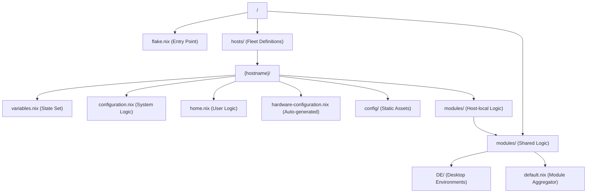
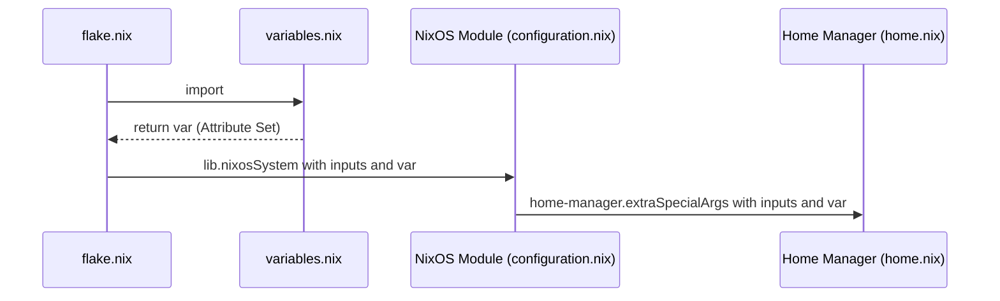

# NixOS Configuration Architecture (Infrastructure & Design)

## 1. ディレクトリ構造とコンポーネント定義

### 1.1 階層構造



### 1.2 構成要素の責務

| コンポーネント      | 役割                                                | 入力                              | 出力                     |
| :------------------ | :-------------------------------------------------- | :-------------------------------- | :----------------------- |
| `flake.nix`         | 全体の統合、依存関係の解決、ホストのインスタンス化  | `inputs`, `hosts/*/variables.nix` | `nixosConfigurations`    |
| `variables.nix`     | ホスト固有のパラメーター定義（純粋なAttribute Set） | なし                              | `var`オブジェクト        |
| `configuration.nix` | システム権限設定（Boot, HW, Network, Users）        | `{ config, pkgs, var, ... }`      | NixOS システムオプション |
| `home.nix`          | ユーザー環境設定（Dotfiles, User Packages）         | `{ config, pkgs, var, ... }`      | Home Manager オプション  |

---

## 2. 実装メカニズムとデータフロー

### 2.1 抽象化レイヤー: `mkHost` ヘルパー

`flake.nix` 内で定義された `mkHost` 関数は、`nixosSystem` インスタンス化の定型処理をカプセル化します。

- **シグネチャ**: `mkHost = hostName: dir: ...`
- **パス解決**: `(dir + "/variables.nix")` のように、ディレクトリパスと文字列を結合してホスト固有のファイルを動的にインポート。
- **アーキテクチャ推論**: `variables.nix` 内の `system.architecture` を読み取り、`nixpkgs.lib.nixosSystem` の `system` 引数へ渡す。

### 2.2 依存注入 (DI) チェーンとスコープ伝播



- **`specialArgs`**: すべてのモジュール引数に `inputs` (Flake inputs) と `var` (Custom variables) を追加。これにより、各モジュールで `import` を記述することなく、グローバルな状態にアクセス可能。
- **Scoped Variables**: Home Manager 統合において、`home-manager.users.${var.user.name}` のように、`var` に基づいた動的な属性パス定義を実施。

### 2.3 モジュール結合と条件付き評価

- **静的な `imports`**: `modules/default.nix`ですべてのモジュールパスをリストアップ。これにより、依存グラフがビルド前に決定される。
- **動的な `mkIf`**: 各モジュール（DE 等）内部で `lib.mkIf var.desktop.enable{Env}` を使用。Nix の遅延評価（Lazy Evaluation）特性を活かし、フラグが `false` のモジュールはビルド対象から除外される。

---

## 4. 拡張ガイドライン

### 4.1 新規ホストの追加

1.  **ディレクトリ作成**: `hosts/template` を `hosts/{hostname}` にコピー。
2.  **変数の調整**: `hosts/{hostname}/variables.nix` を開き、`hostname`, `user.name`, `architecture` 等を設定。
3.  **ハードウェア定義**: インストール先で `nixos-generate-config` を実行し、`hardware-configuration.nix` を配置。
4.  **Flake 登録**: `flake.nix` の `outputs.nixosConfigurations` に `mkHost` 呼び出しを追加。

### 4.2 共有モジュールの追加

1.  **モジュール作成**: `modules/` 配下に機能単位のディレクトリまたはファイルを作成（例: `modules/services/docker.nix`）。
2.  **インターフェイス定義**: `lib.mkIf var.{service}.enable` を使用して条件付き評価を実装。
3.  **集約**: `modules/default.nix` の `imports` に新しいモジュールパスを追加。これにより、全ホストからアクセス可能になる。

---

## 5. 内部データ構造と依存注入 (Deep Dive)

### 5.1 `variables.nix` の構造

`variables.nix` は、設定ロジックを含まない「純粋なデータセット」として構成します。

```nix
{
  user = { name = "fal"; ... };
  system = { architecture = "x86_64-linux"; ... };
  desktop = { enableGnome = true; ... };
}
```

### 5.2 `specialArgs` による DI

`flake.nix` で定義された `var` は、すべての NixOS モジュールの第一引数として自動的に渡されます。

```nix
# モジュール側での受け取り例
{ config, pkgs, var, ... }: {
  networking.hostName = var.system.hostname;
}
```

これにより、各ファイル内での `import "../../hosts/xxx/variables.nix"` といったパス解決を排除し、コードの結合度を下げつつグローバルな状態管理を実現しています。

---

## 6. Home Manager 統合と境界線

### 6.1 システム設定 vs ユーザー設定

本構成では、以下のルールに基づいて設定を分離します。

- **NixOS (configuration.nix)**: ハードウェア、ドライバー、システムサービス（Docker, SSH）、ユーザー管理、フォント。
- **Home Manager (home.nix)**: アプリケーション設定（Dotfiles）、ユーザーパッケージ（Vivaldi, CLIツール）、デスクトップ環境のテーマ設定。

### 6.2 パス解決の原則

Home Manager モジュール（`home.nix`）も `var` にアクセス可能であるため、`var.desktop.gnomeConfigPath` のように `variables.nix` で定義されたリソースパスを直接参照し、一貫性を保ちます。
