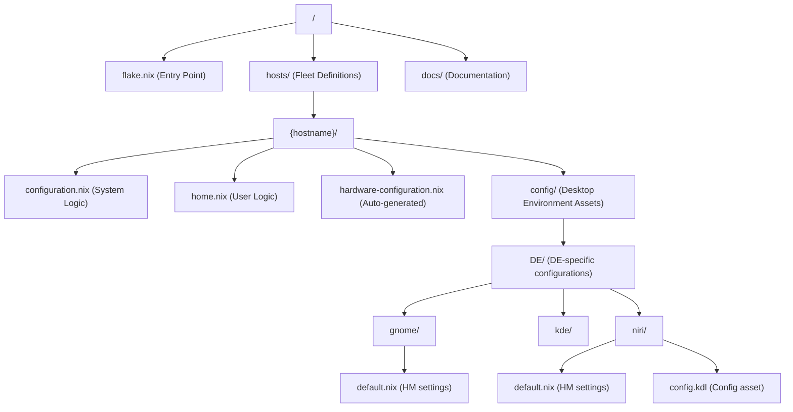

# NixOS Configuration Architecture (Infrastructure & Design)

## 1. ディレクトリ構造とコンポーネント定義

### 1.1 階層構造

```mermaid
graph TD
    Root["/"] --> Flake["flake.nix (Entry Point)"]
    Root --> Hosts["hosts/ (Fleet Definitions)"]
    Root --> Docs["docs/ (Documentation)"]

    Hosts --> HostDir["{hostname}/"]
    HostDir --> Config["configuration.nix (System Logic)"]
    HostDir --> Home["home.nix (User Logic)"]
    HostDir --> HwConfig["hardware-configuration.nix (Auto-generated)"]
    HostDir --> HostConfigDir["config/ (Desktop Environment Assets)"]

    HostConfigDir --> DE["DE/ (DE-specific configurations)"]
    DE --> DE_Gnome["gnome/"]
    DE --> DE_Kde["kde/"]
    DE --> DE_Niri["niri/"]

    DE_Gnome --> Gnome_Def["default.nix (HM settings)"]
    DE_Niri --> Niri_Def["default.nix (HM settings)"]
    DE_Niri --> Niri_Conf["config.kdl (Config asset)"]
```

### 1.2 構成要素の責務

| コンポーネント      | 役割                                               | 定義方法                          | 出力                     |
| :------------------ | :------------------------------------------------- | :-------------------------------- | :----------------------- |
| `flake.nix`         | 全体の統合、ホストのインスタンス化                 | `nixosConfigurations.{name}`      | NixOS システム定義       |
| `configuration.nix` | システム権限設定（Boot, HW, Network, Users）       | ファイル冒頭の `let` 句で変数定義 | NixOS システムオプション |
| `home.nix`          | ユーザー環境設定（Dotfiles, User Packages）        | ファイル冒頭の `let` 句で変数定義 | Home Manager オプション  |
| `config/DE/`        | デスクトップ環境固有の構成（HM設定、アセットなど） | 各ディレクトリ内の `default.nix`  | 独立した構成モジュール   |

---

## 2. 実装メカニズムとデータフロー

### 2.1 直接的な構成定義

以前の抽象化レイヤー（`mkHost` や `variables.nix`）を廃止し、`flake.nix` で直接 `nixosSystem` を定義する標準的なアプローチを採用しています。これにより、Nix の標準的なドキュメントや例をそのまま適用しやすくなっています。

### 2.2 変数管理

グローバルな変数セット（`variables.nix`）の代わりに、`configuration.nix` や `home.nix` のファイル冒頭にある `let ... in` ブロックを使用して、そのホストに必要な設定（ユーザー名、有効化するデスクトップ環境など）を直接定義します。

### 2.3 モジュールの分散管理 (Modular DE Config)

デスクトップ環境（DE）の設定は、`hosts/{hostname}/config/DE/` 配下の各ディレクトリで完結するように設計されています。

- **自己完結型モジュール**: `default.nix` 内で、その DE に必要なパッケージ（`home.packages`）や設定ファイル（`xdg.configFile`）のシンボリックリンク作成を定義します。
- **相対パスの活用**: 設定コードと実際の設定ファイル（例: `config.kdl`）が同じディレクトリに存在するため、パス指定を `./config.kdl` のように相対パスで記述でき、保守性が向上します。
- **条件付きインポート**: `home.nix` で `lib.optionals` を使用し、有効化フラグに基づいてこれらのモジュールを動的にインポートします。

---

## 3. 拡張ガイドライン

### 3.1 新規ホストの追加

1.  **ディレクトリ作成**: `hosts/template`（または既存の `hosts/desktop`）を `hosts/{hostname}` にコピー。
2.  **変数の調整**: `hosts/{hostname}/configuration.nix` と `home.nix` の `let` 句を編集。
3.  **ハードウェア定義**: インストール先で `nixos-generate-config` を実行し、`hardware-configuration.nix` を配置。
4.  **Flake 登録**: `flake.nix` の `outputs.nixosConfigurations` に新しい定義を追加。

### 3.2 アプリケーション設定の追加

1.  **ディレクトリ作成**: `hosts/{hostname}/config/` 配下に適切なディレクトリを作成。
2.  **`default.nix` の作成**: Home Manager の設定（`xdg.configFile` 等）を記述。
3.  **インポート**: `home.nix` の `imports` リストに作成した `default.nix` のパスを追加。

---

## 4. Home Manager 統合と境界線

### 4.1 システム設定 vs ユーザー設定

- **NixOS (configuration.nix)**: ハードウェア、ドライバー、システムサービス、ユーザーアカウント管理、フォント、システムレベルでの DE 有効化フラグ。
- **Home Manager (home.nix / config/DE/)**: ユーザー固有のパッケージ、アプリケーションの詳細設定、テーマ、DE 内部の構成。
